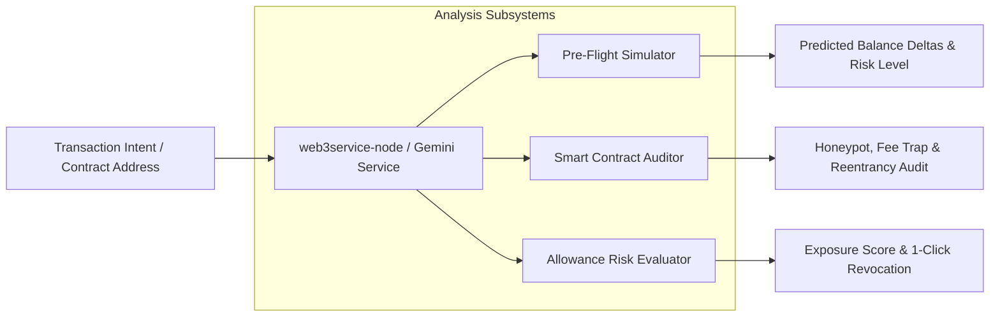

# AI Security & Risk Engine

ThinPay Wallet embeds **Google Gemini 2.0 Flash / Pro** directly into the transaction lifecycle to protect users from malicious testnet contracts, drains, and signature traps.

---

## 1. Engine Capabilities



---

## 2. Gemini Pre-Flight Transaction Simulation

### 2.1 Overview
Before broadcasting a transaction on testnet, users can trigger the **Gemini Pre-Flight Security Check** in the Send Modal. The AI engine performs structural checks and semantic risk analysis.

### 2.2 Endpoint
- **Method**: `POST`
- **Path**: `/api/v1/ai/simulate`
- **Request Payload**:
  ```json
  {
    "to": "0x70997970C51812dc3A010C7d01b50e0d17dc79C8",
    "value": "0.5",
    "chain": "sepolia",
    "sender": "0xf39Fd6e51aad88F6F4ce6aB8827279cffFb92266",
    "data": "0x"
  }
  ```
- **Response**:
  ```json
  {
    "success": true,
    "simulation": {
      "riskLevel": "LOW",
      "summary": "Standard native transfer of 0.5 ETH on Sepolia. Recipient is an EOA.",
      "expectedBalanceChange": "-0.5000 ETH (-$0.00)",
      "securityChecks": {
        "isContract": false,
        "isKnownPhishing": false,
        "drainPatternDetected": false
      },
      "recommendation": "Safe to proceed with testnet broadcast."
    }
  }
  ```

---

## 3. Smart Contract Safety Auditor

Located under the `/auditor` route, the auditor evaluates contract source code or bytecode for critical attack vectors:
1. **Reentrancy Vulnerabilities**: Detects non-reentrant external calls made before state updates.
2. **Honeypot Traps**: Identifies transfer blocks, blacklists, and selective revert mechanisms.
3. **Hidden Fees & Tax Traps**: Scans for dynamic fee functions with >10% transfer tax logic.
4. **Owner Privileges**: Highlights unconstrained `mint()`, `pause()`, or self-destruct functions.

### Caching Architecture
Audit results are hashed by bytecode and cached in the Neon PostgreSQL database (`contract_audits` table), ensuring zero redundant Gemini API queries and instant response times for previously inspected contracts.

---

## 4. Token Approvals & Allowance Manager

Located under the `/approvals` route, this subsystem scans existing ERC-20 allowances:
- Evaluates token spenders against known DeFi protocol contracts (Uniswap, Aave, 0x).
- Identifies **Unlimited Allowances** (`type(uint256).max`) that present ongoing wallet drain risks.
- Provides one-click **Revoke Allowance** buttons that construct and broadcast `approve(spender, 0)` transactions.
