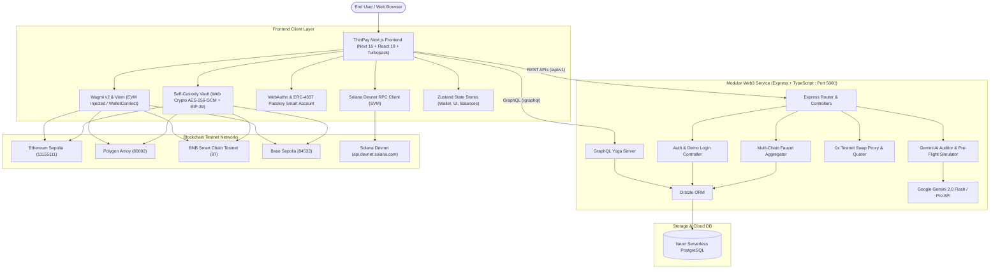

# Architecture & Design Overview: ThinPay Wallet

ThinPay Wallet is a next-generation, multi-chain Web3 DeFi portal engineered for cross-chain testnets, account abstraction, self-custody key management, and AI-powered transaction security.

---

## 1. High-Level System Architecture

---

## 2. Core Modules Breakdown

### 2.1 Multi-Chain Custody & Authentication Matrix
ThinPay provides 4 distinct authentication and wallet custody layers:
1. **Self-Custody Testnet Vault**:
   - BIP-39 mnemonic generation (12 English words).
   - Local client-side AES-256-GCM encryption with PBKDF2 (100,000 iterations).
   - In-memory private key signing via `viem/accounts` and direct RPC node dispatch.
   - Zero telemetry of user seed phrases or passwords.
2. **ERC-4337 Account Abstraction & Passkeys**:
   - WebAuthn biometric login (Windows Hello, Touch ID, Face ID).
   - Deterministic smart account address generation.
   - Gas-sponsored paymaster execution mode.
   - Multi-recipient UserOperation batch bundler.
3. **Injected Web3 & Solana Adapters**:
   - EVM wallets: MetaMask, Coinbase Wallet, Rabby, Rainbow via Wagmi v2.
   - Solana SVM: Native Phantom wallet connector & direct JSON-RPC to `api.devnet.solana.com`.
4. **Instant 1-Click Demo Mode**:
   - Pre-seeded testnet wallet powered by Neon DB and JWT session storage.
   - Allows users to explore swaps, AI audits, and DeFi baskets without installing extensions.

---

### 2.2 DeFi & Swap Subsystem
- **0x Protocol Swap Aggregator**: Integrated with 0x API v1/v2 for testnet quote pricing, slippage management, and route calculation.
- **Cross-Chain Bridge Mock**: Simulates cross-chain messaging and token bridging across Sepolia, Amoy, BSC Testnet, and Base Sepolia.
- **Thematic DeFi Baskets**: Curated asset baskets (e.g., *Layer 2 Giants*, *DeFi Bluechips*, *AI & Big Data*) allowing 1-click diversified allocations.
- **Dynamic Live Balance Fetching**: Real-time multicall and RPC balance fetching across all supported chains, cached efficiently via TanStack React Query.

---

### 2.3 AI Safety Engine
- **Contract Auditor**: Google Gemini 2.0 inspects verified bytecode or Solidity source code to evaluate reentrancy, honeypot traits, fee traps, and hidden mint privileges.
- **Pre-Flight Simulation**: Intercepts transactions before submission to simulate execution outcomes, predicting risk score (LOW, MEDIUM, HIGH), balance deltas, and contract trustworthiness.
- **Token Approvals & Revocation**: Scans existing ERC-20 allowances, calculates exposure risk using AI, and generates one-click `approve(spender, 0)` revoke transactions.

---

### 2.4 Multi-Chain Testnet Faucet Aggregator
- Instant faucet drip service supporting 5 testnets:
  - Ethereum Sepolia: `0.05 ETH`
  - Polygon Amoy: `10 POL`
  - BSC Testnet: `0.05 BNB`
  - Base Sepolia: `0.05 ETH`
  - Solana Devnet: `1 SOL`
- Built-in 60-minute cooldown protection per IP and wallet address with persistent state tracking in Neon DB.

---

## 3. Technology Stack Reference

| Layer | Technologies |
|---|---|
| **Frontend Framework** | Next.js 16.3.6 (App Router, Turbopack, React 19.2.8) |
| **Styling & UI** | Tailwind CSS v4, shadcn/ui components, Lucide icons, Sonner toasts |
| **Web3 & Blockchain** | Viem 2.56, Wagmi 3.7, TanStack Query 5, Solana JSON-RPC |
| **State Management** | Zustand (Persistent wallet store, UI store) |
| **Backend Framework** | Node.js, Express, TypeScript, GraphQL Yoga |
| **Database & ORM** | Neon Serverless PostgreSQL, Drizzle ORM |
| **AI Engine** | Google Gemini 2.0 Flash / Pro API via official Google GenAI SDK |
| **Cryptography** | Web Crypto API (SubtleCrypto PBKDF2 + AES-GCM), BIP-39 |
