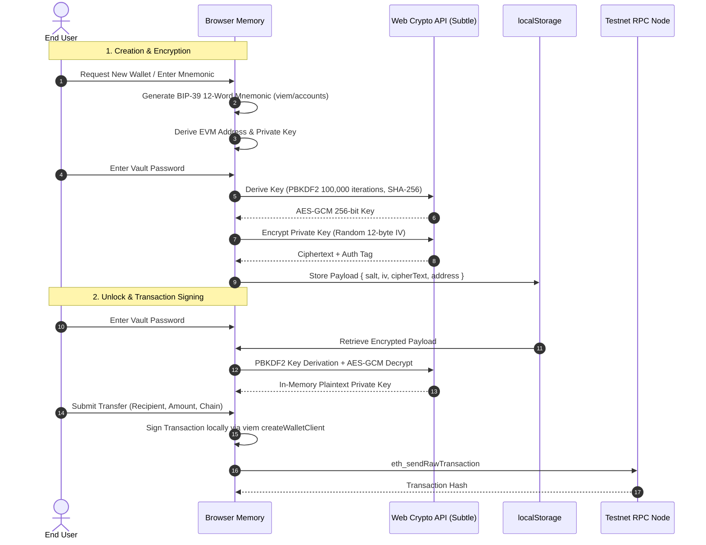

# Authentication & Custody Matrix

ThinPay Wallet supports four distinct login and key custody models designed to balance institutional self-sovereignty with seamless onboarding.

---

## 1. Supported Authentication Methods

| Auth Mode | Key Custody | Gas Sponsoring | Prerequisites | Best For |
|---|---|---|---|---|
| **Self-Custody Vault** | 100% Client-Side Encrypted | User (Native Testnet Gas) | Password | High security, seed phrase backup, extension-less sovereign wallet |
| **Passkey Smart Account (ERC-4337)** | Biometric Hardware Security Module (WebAuthn) | Yes (ThinPay Paymaster Gasless) | Fingerprint / Face ID / Windows Hello | Web2-like onboarding, sponsored gas, multi-send bundling |
| **Injected Web3 / Phantom** | User Browser Extension | User (Native Testnet Gas) | MetaMask, Rabby, Phantom | Native Web3 power users with existing testnet setups |
| **Instant 1-Click Demo** | Ephemeral / Neon DB Session | Simulated / Pre-funded | None | Immediate zero-friction testing and demonstrations |

---

## 2. Deep Dive: Self-Custody Vault

### 2.1 Cryptographic Workflow
The Self-Custody Vault operates exclusively in client memory and browser local storage using the native Web Crypto API (`window.crypto.subtle`).



### 2.2 Storage Schema
Encrypted vaults are stored in `localStorage` under key `thinpay_vault_encrypted`:
```typescript
interface EncryptedVaultPayload {
  version: 1;
  salt: string;        // 16-byte random salt (hex)
  iv: string;          // 12-byte random AES initialization vector (hex)
  cipherText: string;  // AES-256-GCM encrypted private key string (hex)
  address: string;     // Public EVM address
  createdAt: number;   // Epoch millisecond timestamp
}
```

---

## 3. Deep Dive: ERC-4337 Passkey Smart Account

### 3.1 WebAuthn Integration
- Leverages the W3C Web Authentication API (`navigator.credentials.create` and `get`).
- Employs secure hardware elements (Apple Secure Enclave, Android Titan M, Windows TPM).
- Derives a deterministic smart account proxy contract address on EVM testnets.

### 3.2 Paymaster Sponsored Gas
- When **ERC-4337 Gasless Mode** is toggled on in the Send Modal, gas fees are sponsored by the ThinPay Paymaster contract.
- Allows testnet transfers even if the account holds zero native gas tokens.

### 3.3 Batch Multi-Send Bundling
- Bundles transfers to multiple recipients into a single atomic `UserOperation`.
- Prevents multiple transaction approvals and reduces overall execution overhead.

---

## 4. Deep Dive: Solana Devnet & Phantom Adapter

ThinPay incorporates SVM compatibility alongside EVM networks:
- **Phantom Detection**: Checks for `window.phantom?.solana` or `window.solana`.
- **Direct Devnet RPC**: Balances and transactions are verified directly via `https://api.devnet.solana.com`.
- **Solana Transfer Execution**: Converts SOL amounts to Lamports and signs transfer instructions natively using the Phantom provider.
