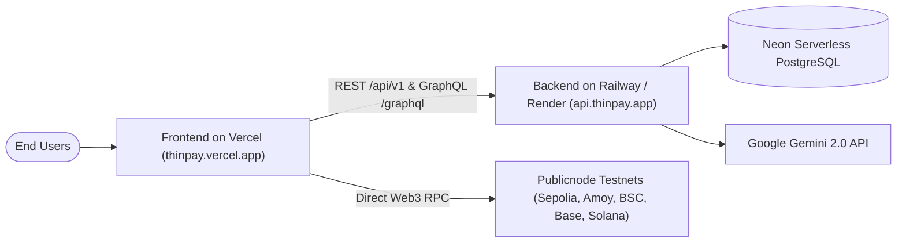

# Deployment Guide: ThinPay Wallet

This guide walks you through deploying ThinPay to production with **Vercel** for the Next.js frontend and a modern cloud host (Railway / Render / Fly.io / Docker) for the Express backend, backed by Neon Serverless PostgreSQL.

---

## 1. Architecture Overview

ThinPay consists of three components:
1. **Frontend (`thinpay-next`)**: Next.js 16 (App Router + Turbopack + React 19) $\rightarrow$ **Vercel**
2. **Backend (`web3service-node`)**: Node.js/Express + GraphQL Yoga + Drizzle ORM $\rightarrow$ **Railway / Render**
3. **Database**: PostgreSQL with SSL $\rightarrow$ **Neon Serverless PostgreSQL**



---

## 2. Step 1: Database Setup (Neon PostgreSQL)

ThinPay uses Neon for serverless PostgreSQL.
1. Sign up or log into [Neon](https://neon.tech).
2. Create a project named `thinpay-db`.
3. In the Neon Console Dashboard, copy your connection string (`DATABASE_URL`):
   ```
   postgresql://<user>:<password>@<endpoint-pooler>.neon.tech/neondb?sslmode=require
   ```
4. Run migrations and initial seeds against this database from your local machine:
   ```bash
   cd thinpay-next/web3service-node
   npm run db:migrate
   npm run db:seed
   ```

---

## 3. Step 2: Deploy Backend (`web3service-node`)

The backend must be deployed first so you have the live API URL to provide to Vercel.

### Option A: Deploy to Railway (Recommended)
1. Go to [railway.app](https://railway.app) and create a **New Project**.
2. Select **Deploy from GitHub repo** $\rightarrow$ select your repository (`thinpay-wallet`).
3. Set the **Root Directory** in Railway Settings:
   - Root Directory: `thinpay-next/web3service-node` (or if your repo root contains `web3service-node`, point to it).
4. Configure Build & Start Commands:
   - **Build Command**: `npm run build`
   - **Start Command**: `npm start`
5. Add the following **Environment Variables** in Railway:
   | Variable | Value |
   |---|---|
   | `NODE_ENV` | `production` |
   | `PORT` | `5000` |
   | `DATABASE_URL` | `postgresql://...neon.tech/neondb?sslmode=require` |
   | `GEMINI_API_KEY` | `your_google_gemini_api_key` |
   | `ZERO_EX_API_KEY` | `d0f0825e-095b-4bdf-845a-26fa0dbb6b7d` |
   | `JWT_SECRET` | `generate_a_random_32_char_secret_string` |
   | `CORS_ORIGIN` | `https://*.vercel.app,https://your-custom-domain.com` |
6. In **Settings > Networking**, click **Generate Domain**. You will receive an address like:
   `https://thinpay-api-production.up.railway.app`
7. Verify by opening `https://thinpay-api-production.up.railway.app/health` in your browser. It should return `{"status":"ok"}`.

### Option B: Deploy to Render
1. Go to [render.com](https://render.com) $\rightarrow$ **New Web Service**.
2. Connect your GitHub repository.
3. Settings:
   - **Root Directory**: `thinpay-next/web3service-node`
   - **Environment**: Node
   - **Build Command**: `npm install && npm run build`
   - **Start Command**: `npm start`
4. Add the same Environment Variables as above.

---

## 4. Step 3: Deploy Frontend to Vercel

### Method 1: Deploy via Vercel Web Dashboard (Easiest)

1. Push your latest code to your GitHub repository:
   ```bash
   git push origin main
   ```
2. Go to [vercel.com](https://vercel.com) and click **"Add New..." > "Project"**.
3. Import your GitHub repository (`thinpay-wallet`).
4. In the **Configure Project** screen:
   - **Framework Preset**: Next.js (automatically detected)
   - **Root Directory**: Click **Edit** and select `thinpay-next` (IMPORTANT: if your repo root has `thinpay-next`, set root directory to `thinpay-next`).
5. Expand **Environment Variables** and enter:
   | Variable | Value | Description |
   |---|---|---|
   | `NEXT_PUBLIC_API_URL` | `https://thinpay-api-production.up.railway.app/api/v1` | URL of your deployed backend + `/api/v1` |
   | `NEXT_PUBLIC_GRAPHQL_URL` | `https://thinpay-api-production.up.railway.app/graphql` | URL of your deployed backend + `/graphql` |
   | `NEXT_PUBLIC_WALLETCONNECT_PROJECT_ID` | `46fc298ae0d511f88be4f78acf36c167` | Reown / WalletConnect Cloud project ID |
6. Click **Deploy**. Vercel will run `next build` and deploy your app in under 60 seconds!

---

### Method 2: Deploy via Vercel CLI

If you prefer deploying directly from your terminal:

```bash
# 1. Install Vercel CLI globally
npm install -g vercel

# 2. Change into the frontend directory
cd thinpay-next

# 3. Authenticate and deploy preview
vercel

# 4. Follow interactive prompts:
# - Set up and deploy? [Y]
# - Which scope? [Your Account]
# - Link to existing project? [N]
# - Project name? thinpay-wallet
# - In which directory is your code located? ./
# - Want to modify build settings? [N]

# 5. Add environment variables
vercel env add NEXT_PUBLIC_API_URL production
vercel env add NEXT_PUBLIC_GRAPHQL_URL production
vercel env add NEXT_PUBLIC_WALLETCONNECT_PROJECT_ID production

# 6. Deploy to production
vercel --prod
```

---

## 5. Post-Deployment Verification Checklist

Once deployed, run this checklist on your live Vercel URL (e.g., `https://thinpay-wallet.vercel.app`):

- [ ] **Landing & Login Flow**:
  - Visit `/` and verify hero, feature cards, and CTA buttons.
  - Click **"Launch App"** or **"Sign In"** $\rightarrow$ redirects to `/login`.
  - Test **"Launch Instant Demo"** $\rightarrow$ provisions a session and enters `/dashboard`.
- [ ] **Self-Custody Vault**:
  - Open `/login` $\rightarrow$ click **"Open / Create Self-Custody Vault"**.
  - Generate a new 12-word recovery phrase, set a password, and verify you are logged in.
- [ ] **Multi-Chain Faucet Aggregator**:
  - Click the **"Faucet"** button in the top header.
  - Claim Sepolia ETH or Polygon Amoy POL $\rightarrow$ verify success toast and cooldown timer.
- [ ] **Gemini AI Pre-Flight Simulation**:
  - Click **"Send"** $\rightarrow$ fill in a testnet address and amount $\rightarrow$ click **"Simulate Tx"**.
  - Verify Gemini returns risk assessment and balance change predictions.
- [ ] **Token Approvals & Revocation**:
  - Navigate to `/approvals` in the sidebar $\rightarrow$ check risk assessment badges.
- [ ] **DeFi Baskets**:
  - Navigate to `/baskets` $\rightarrow$ inspect basket composition, APY, and 1-click allocation.
- [ ] **Phantom / Solana Devnet**:
  - Click **Connect Wallet** $\rightarrow$ connect Phantom $\rightarrow$ verify Devnet SOL balance appears.

---

## 6. Troubleshooting Common Issues

### Issue 1: CORS Error in Browser Console
- **Symptom**: `Access to fetch at 'https://api...' from origin 'https://thinpay.vercel.app' has been blocked by CORS policy`
- **Fix**: In your backend host (Railway/Render), verify `CORS_ORIGIN` includes your Vercel URL or `https://*.vercel.app`. The backend's updated `server.ts` automatically permits any `*.vercel.app` domain.

### Issue 2: Vercel Build Fails with "Root Directory"
- **Symptom**: `package.json not found` or `next not recognized`
- **Fix**: In Vercel Project Settings > General > **Root Directory**, specify `thinpay-next`.

### Issue 3: Gemini AI Errors (`500 Internal Server Error`)
- **Fix**: Ensure your `GEMINI_API_KEY` is added to the backend environment variables without quotes or spaces. You can acquire a free Gemini API key at [Google AI Studio](https://aistudio.google.com).
